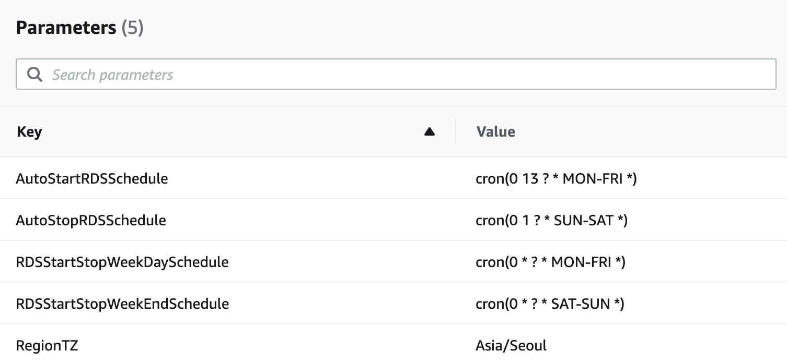
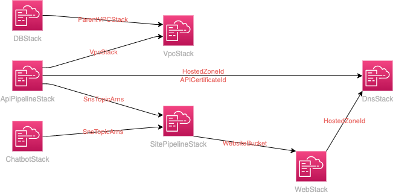
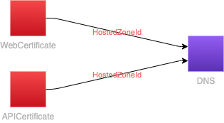
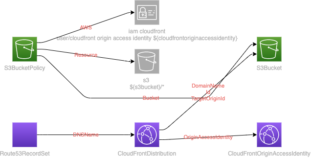
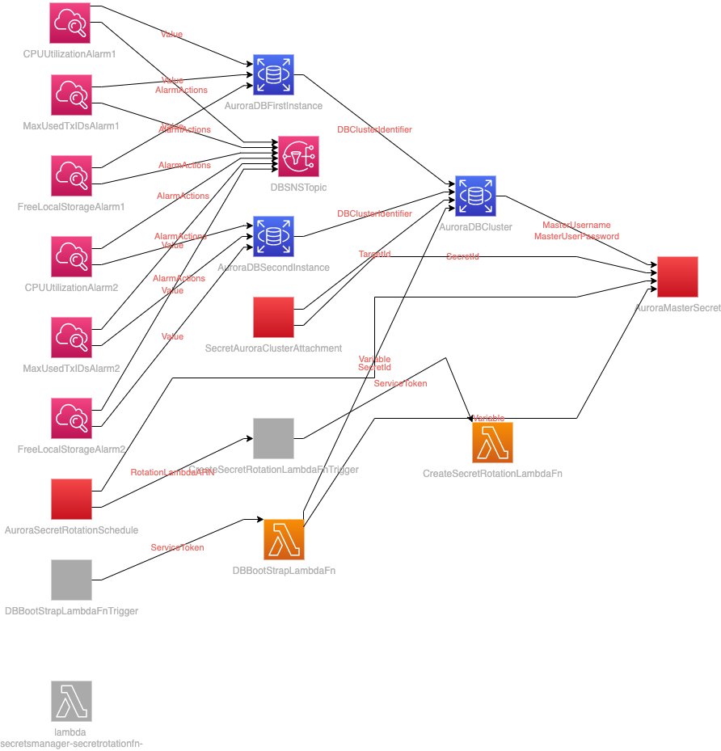
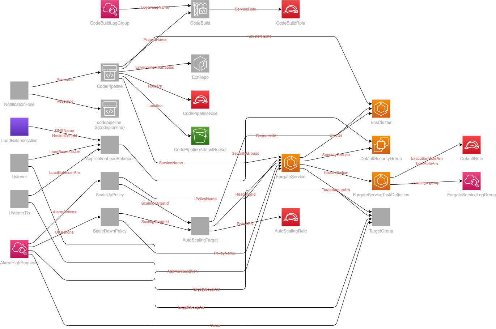

# 인프라 배포

## 사전 가정

1. Clouformation 템플릿 파일 저장용 S3 버킷을 생성합니다.
1. TSL/SSL 인증서를 위한(CloudFront) ACM(us-east-1) 인증서 생성(또는 dns.yml 활용)
1. 루트 도메인이 외부 도메인 관리 기관에 있을 경우 NS 레코드 등록
1. 루트 도메인에 NS 레코드 등록 시 실시간 대응이 안될 경우 AWS Hosted Zone을 미리 생성하여 NS 레코드 복사 후 리소스 삭제(재 생성 시 동일한 NS 유지)
1. Github 개발자 설정 > Personal Token 발행 후 AWS Secret Manager에 등록
1. CI/CD를 위한 웹사이트 Github repository API Github repository 생성(Base 코드)
1. AWS Chatbot 콘솔에서 Slack으로 초기 권한 부여 흐름을 수행한 다음 콘솔에서 작업 공간 ID를 복사합니다. 자세한 내용은 AWS Chatbot 사용 설명서의 "[Slack으로 AWS Chatbot 설정](https://docs.aws.amazon.com/ko_kr/chatbot/latest/adminguide/what-is.html)"의 1-4단계를 참조하십시오.
1. API용 Docker 이미지 생성 후 Docker Image 주소(ECR, DockerHub) 복사([없을 경우 생성 필요](https://github.com/dumulnet/cfn-cf-fargate-rds#api%EC%9A%A9-docker-%EC%9D%B4%EB%AF%B8%EC%A7%80-%EC%83%9D%EC%84%B1))


 


## 상세 절차

### TSL/SSL 인증서 생성(us-east-1)
1. AWS Console > us-east-1 > CloudFormation > 스택생성 > dns.yml 업로드
1. Route53 > 생성된 Hosted Zone 선택 > NS 레코드 복사(4개)
1. 외부 도메인 관리 시스템 접속 후 Web, API를 위한 서브 도메인용 NS 레코드 붙여넣기
1. AWS Console > us-east-1 > ACM > 인증서 검증(DNS)이 정상적으로 확인되었는지 체크합니다.

### API용 Docker 이미지 생성
1. AWS Console > ap-northeast-2 > ECR > Repository 생성 > '이름' 지정
1. Command Line에서 Docker 최초 이미지 생성 후 Push
1. AWS Console > ap-northeast-2 > ECR > Repositories > Image > 업로드된 Image 주소 복사
```
//SSO Login > Profile 생성
$ aws configure sso
$ aws ecr get-login-password --region ap-northeast-2 --profile '프로파일' | docker login --username AWS --password-stdin [AWS_ACCOUNT_ID].dkr.ecr.[AWS_REGION].amazonaws.com

$ cd [Working directory]
$ docker build -t "ECR 리포 이름" .

//Tag docker image
$ docker tag [ECR 리포 이름]:latest [AWS_ACCOUNT_ID].dkr.ecr.[AWS_REGION].amazonaws.com/[ECR 리포 이름]:latest

//Push image
$ docker push [AWS_ACCOUNT_ID].dkr.ecr.[AWS_REGION].amazonaws.com/[ECR 리포 이름]:latest
```

### 전체 Infra 생성

1. AWS Console > S3 > CloudFormation 작업용 버킷을 생성합니다.(리전 확인)
1. main.yml 파일을 제외하고 모든 yml 파일을 1번에서 생성한 버킷에 업로드합니다.
1. AWS Console > CloudFormation 에서 Stack 생성을 누르고 main.yml 파일을 선택합니다.
1. cfn 템플릿 변수에 값을 입력하고 생성합니다.
1. 다음을 선택하고 필요한 경우 태그를 제공합니다.
1. 다음을 선택하고 스택 세부 정보를 검토합니다.
1. 이 템플릿은 IAM 역할 및 정책을 생성하므로 승인 확인란을 선택합니다.
1. 스택 생성을 선택합니다.
1. 스택을 열고 리소스 탭으로 이동하여 리소스 생성 상태를 추적합니다.

### 관리 Infra 생성

1. RDS 자동 기동 및 중지를 위해 auto-start-stop-rds.yml 스택을 생성
1. RDS의 Tag 설정
    1. 고정 시간 기동/중지를 위한 Tag Key: AutoStart = true/false, AutoStop = true/false
    1. 개별 시간 기동/중지를 위한 Tag Key: StartWeekDay = HH:MM, StopWeekDay = HH:MM, StartWeekEnd = HH:MM, StopWeekEnd = HH:MM
    1. 주기적인 Tag 체크를 위한 스택 파라미터 설정 
    1. Tag 지정을 위해서는 해당 RDS 인스턴스가 기동 상태이어야 함

## 기본 스택

### root 스택

[](https://dumulnet.github.io/cfn-cf-fargate-rds/main)

### VPC 스택

[](https://dumulnet.github.io/cfn-cf-fargate-rds/vpc)

### DNS 스택

[](https://dumulnet.github.io/cfn-cf-fargate-rds/dns)

## 웹호스팅 스택

[](https://dumulnet.github.io/cfn-cf-fargate-rds/web)

## 웹 CI/CD 파이프라인 스택

[](https://dumulnet.github.io/cfn-cf-fargate-rds/site-pipeline)

## DB Cluster 스택

[](https://dumulnet.github.io/cfn-cf-fargate-rds/aurora-postgres-db-cluster)


## API CI/CD 파이프라인 스택

[](https://dumulnet.github.io/cfn-cf-fargate-rds/api-pipeline)g

## Chatbot 스택

[](https://dumulnet.github.io/cfn-cf-fargate-rds/chatbot)

## 인프라 관리 스팩 생성

### RDS 자동 기동 및 중지


## CloudFormation 작업 가이드

- [CloudFormation 아키텍처 다이어그램](https://github.com/mhlabs/cfn-diagram)
- [Level up CloudFormation with VS Code](https://towardsthecloud.com/level-up-cloudformation-vscode)
- [AWS CloudFormation Workshop](https://catalog.workshops.aws/cfn101/en-US)
- [공식 도움말](https://docs.aws.amazon.com/ko_kr/AWSCloudFormation/latest/UserGuide/Welcome.html)

## Troubleshooting

### Serverless Site Hosting
- [Restricting access to an Amazon S3 origin](https://docs.amazonaws.cn/en_us/AmazonCloudFront/latest/DeveloperGuide/private-content-restricting-access-to-s3.html)
- [Automate Building a Unique Domain Hosting Environment with AWS CloudFormation](https://dev.to/aws-builders/automate-building-a-unique-domain-hosting-environment-with-aws-cloudformation-4ehl)
- [Retrieve StackName from nested Stacks in AWS CloudFormation](https://www.itonaut.com/2020/01/10/retrieve-stackname-from-nested-stacks-in-aws-cloudformation/)
- [CloudFront 캐시 무효화](https://hyeon9mak.github.io/cloudfront-caching-control-with-invalidations/)


### CI/CD for site hosting
- S3 에 static file을 배포하는 방법이 두 가지가 있음
    1. Bulild 과정에서 S3 버킷과 Sync하는 방법: 기존 배포 과정에서 Build 과정이 필요한 경우 쉽고 빠르게 전달 가능
    1. CodePipeline에서 직접 S3 버킷을 타겟으로 배포하는 방법(압축 전송 및 해제): Build 과정이 없는 경우 별도 배포 단계 진행
- [CodeBuild로 배포하기](https://mckinnel.me/deploy-a-static-blog-quickly-on-aws.html)
- [CodeDeploy로 배포하기](https://dev.to/giyoungjr/cloudformation-template-to-create-a-cicd-pipeline-for-a-react-application-hosted-in-an-s3-bucket-39g2)

### Chatbot 

- [AWS Chatbot](https://github.com/Sellix/aws-chatbot/blob/master/cloudformation.yml)
- [CodePipeline 챗봇](https://github.com/symphoniacloud/codepipeline-chatbot/blob/master/template.yaml)
- [Notification Rule for CodePipeline](https://docs.aws.amazon.com/ko_kr/dtconsole/latest/userguide/concepts.html#concepts-api)
- [Notification Rule](https://docs.aws.amazon.com/ko_kr/dtconsole/latest/userguide/concepts.html#concepts-api)

### Fargate CI/CD

- [AWS Fargate](https://github.com/dumulnet/aws-cloudformation-reference)

### RDS Auto Start & Stop

- [Automate Start and Stop of Amazon RDS Instances to Save costs](https://github.com/dumulnet/aws-cfn-save-costs-auto-start-stop-rds)
